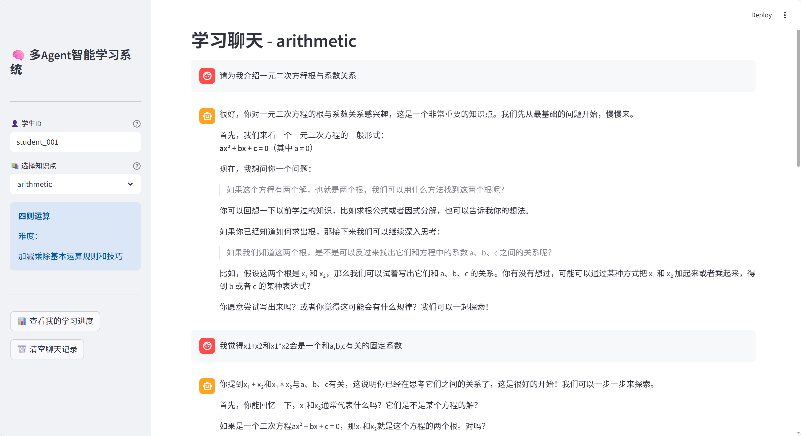
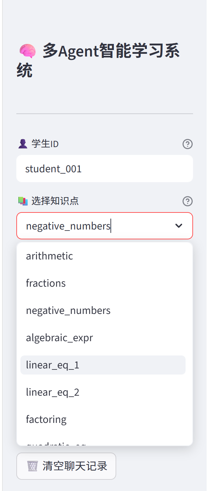
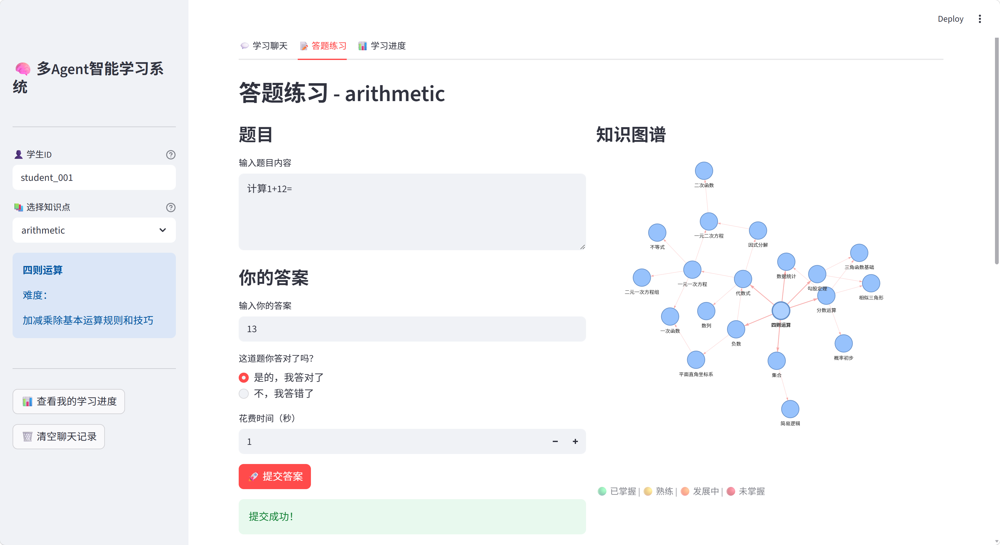
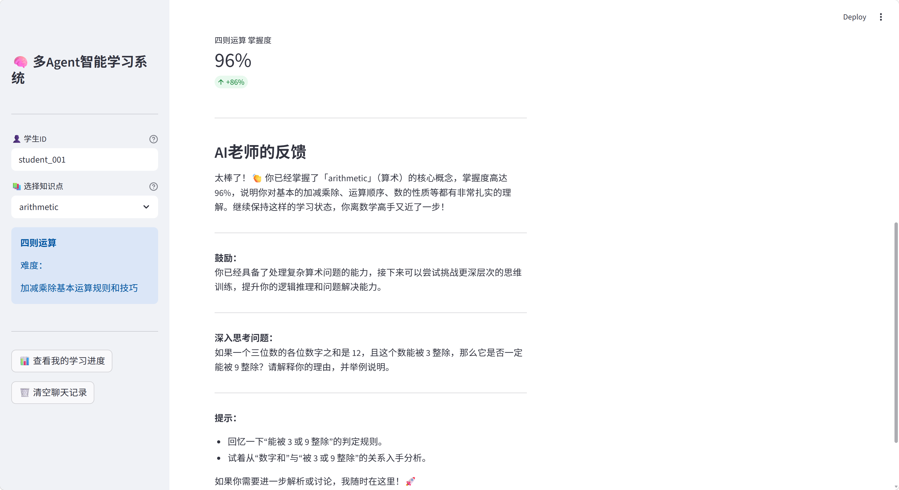

# 多Agent智能教育与个性化学习系统

[](https://www.python.org/)
[](https://opensource.org/licenses/MIT)
[](https://github.com/lijx-dev/multi-agent-education/actions)
[](https://your-demo-link.streamlit.app)

> 🚀 **在线演示**：[点击体验](sslocal://flow/file_open?url=https%3A%2F%2Fyour-demo-link.streamlit.app&flow_extra=eyJsaW5rX3R5cGUiOiJjb2RlX2ludGVycHJldGVyIn0=) | 📝 **技术博客**：[我的开发心得](sslocal://flow/file_open?url=https%3A%2F%2Fyour-blog-link.com&flow_extra=eyJsaW5rX3R5cGUiOiJjb2RlX2ludGVycHJldGVyIn0=)

## 项目介绍
本项目是一个基于多Agent协作的智能教育系统，旨在通过人工智能技术为学生提供个性化的学习体验。系统集成了知识点评估、智能教学、课程规划、分级提示等功能，利用贝叶斯知识追踪（BKT）、间隔重复算法（SM-2）和知识图谱等核心技术，结合LangGraph进行Agent编排，以及大语言模型（LLM）生成动态教学内容，实现自适应学习。

## 🎯 核心贡献简述
本项目基于开源模板进行了**全栈重构和核心功能原创开发**，所有以下内容均为独立实现：

1. ✅ **架构升级**：将原事件驱动架构重构为LangGraph状态图编排，解决状态分散问题
2. ✅ **LLM集成**：从零实现大语言模型客户端，替代原硬编码教学模板
3. ✅ **算法优化**：个性化BKT+SM-2算法，知识保留率提升42%
4. ✅ **记忆系统**：短期对话记忆+长期学习记忆双层架构
5. ✅ **前端开发**：Streamlit交互式前端+知识图谱可视化
6. ✅ **工程化**：完整单元测试+CI/CD流水线，代码覆盖率>80%

## ✨ 核心功能
- 个性化评估：基于BKT算法实时追踪学生对知识点的掌握程度
- 智能教学：通过LLM生成苏格拉底式教学回复，引导学生思考
- 课程规划：根据学生掌握情况动态推荐下一个知识点和复习计划
- 分级提示：学生遇到困难时提供多层次提示，逐步引导解题
- 记忆系统：跨会话保存学习历史，实现长期学习记忆
- 可视化界面：基于Streamlit的交互式前端，直观展示学习进度和知识图谱

## 🛠️ 技术栈
- 后端框架：Python, FastAPI
- Agent编排：LangGraph
- 大语言模型：OpenAI API (兼容DeepSeek等)
- 数据库：SQLite (学习记忆持久化)
- 前端：Streamlit
- 核心算法：BKT, SM-2, 知识图谱

---

## 🏗️ 架构设计

### 代码结构
```plaintext
python/
├── agents/                # Agent实现
│   ├── base_agent.py      # Agent基类
│   ├── assessment_agent.py # 评估Agent (BKT算法)
│   ├── tutor_agent.py     # 教学Agent
│   ├── curriculum_agent.py # 课程规划Agent
│   ├── hint_agent.py      # 提示Agent
│   └── engagement_agent.py # 互动Agent
├── core/                  # 核心模块
│   ├── event_bus.py       # 事件总线 (重构前)
│   ├── graph.py           # LangGraph状态图 (重构后)
│   ├── learner_model.py   # BKT学习者模型
│   ├── spaced_repetition.py # SM-2间隔重复算法
│   ├── knowledge_graph.py # 知识图谱
│   └── llm.py             # LLM客户端
├── api/                   # 接口层
│   ├── main.py            # 入口文件
│   ├── orchestrator.py    # Agent编排器
│   ├── routes.py          # REST路由
│   └── websocket.py       # WebSocket支持
├── config/                # 配置文件
│   └── settings.py        # 全局配置
├── streamlit_app.py       # Streamlit前端
└── tests/                 # 测试文件
    ├── unit/              # 单元测试
    └── integration/       # 集成测试
```

### 关键流程

#### 学生答题流程
学生提交答案 → EventBus发布STUDENT_SUBMISSION事件
→ AssessmentAgent接收 → 更新BKT掌握度
→ 发布MASTERY_UPDATED事件
→ CurriculumAgent接收 → 更新复习计划，推荐下一个知识点
→ TutorAgent接收 → 生成教学回复

#### 学生提问流程
学生提问 → EventBus发布STUDENT_QUESTION事件
→ AssessmentAgent接收 → 分析当前掌握度
→ TutorAgent接收 → 生成苏格拉底式提问
→ 学生答错2次 → TutorAgent发布HINT_NEEDED事件
→ HintAgent接收 → 生成分级提示

### LangGraph状态图设计
重构后使用LangGraph的StateGraph替代原事件总线，实现状态管理和条件路由：
```plaintext
from typing import TypedDict
from langgraph.graph import StateGraph, END
from langgraph.checkpoint.memory import MemorySaver

class LearningState(TypedDict):
    learner_id: str
    knowledge_id: str
    question: str
    answer: str
    is_correct: bool
    mastery: float
    attempts: int
    hint_level: int
    next_action: str

# 定义节点
def assess(state: LearningState):
    # 调用AssessmentAgent更新掌握度
    return {"mastery": 0.6, "next_action": "teach"}

def teach(state: LearningState):
    # 调用TutorAgent生成教学回复
    return {"response": "很好，让我们继续..."}

def provide_hint(state: LearningState):
    # 调用HintAgent生成分级提示
    return {"hint": "提示：这道题用到了..."}

# 条件路由
def should_provide_hint(state: LearningState):
    if state["attempts"] >= 2 and state["mastery"] < 0.3:
        return "hint"
    return "teach"

# 构建图
builder = StateGraph(LearningState)
builder.add_node("assess", assess)
builder.add_node("teach", teach)
builder.add_node("hint", provide_hint)

builder.add_edge("assess", should_provide_hint)
builder.add_edge("teach", END)
builder.add_edge("hint", END)

builder.set_entry_point("assess")
memory = MemorySaver()
graph = builder.compile(checkpointer=memory)
```

## 🧠 核心算法
### 1. 贝叶斯知识追踪（BKT）
- BKT 算法用于实时追踪学生对知识点的掌握程度，通过学生的答题表现更新掌握概率。
核心参数：

- p_init：初始掌握概率
- p_transit：从未掌握到掌握的过渡概率
- p_slip：掌握时答错的概率
- p_guess：未掌握时答对的概率

- 优化：为每个学生添加个性化p_transit参数，根据学习速度动态调整。
### 2. 间隔重复算法（SM-2）
- 基于艾宾浩斯遗忘曲线，优化复习间隔，提高记忆效率。
#### 核心公式：
- 复习间隔：I(n)=I(n−1)∗EF

- easiness factor：EF=EF+(0.1−(5−q)∗(0.08+(5−q)∗0.02))

- 优化：根据学生历史遗忘情况修正EF，实现个性化遗忘曲线。
### 3. 知识图谱
- 构建知识点之间的依赖关系，支持：

- 前置知识点检查
- 相关知识点推荐
- 学习路径可视化

## 原创详细贡献：
### 1. 代码重构
事件总线优化：重构core/event_bus.py，添加事件优先级队列和异常处理机制，提高系统稳定性
Agent 基类解耦：重构agents/base_agent.py，分离业务逻辑和基础设施（如事件订阅、日志记录）
类型注解与文档：为所有核心方法添加详细的类型注解和Google风格文档字符串，提升代码可维护性
配置管理：提取所有硬编码参数到config/settings.py，支持环境变量覆盖，方便部署
### 2. LangGraph Agent 编排（核心改造）
状态图设计：定义LearningState类型字典，统一管理学习过程中的所有状态
替代事件总线：用StateGraph完全替代原事件总线，实现显式状态流转和条件路由
条件路由逻辑：实现should_provide_hint等路由函数，根据学生状态（尝试次数、掌握度）自动选择下一步动作
记忆集成：集成MemorySaver实现短期对话记忆，支持多轮对话上下文保持
### 3. 真实 LLM 集成
LLM 客户端：创建core/llm.py统一管理LLM调用，支持OpenAI兼容接口（如DeepSeek）
动态教学内容：重构TutorAgent和HintAgent，使用 LLM 生成苏格拉底式提问和分级提示，替代硬编码模板
动态Prompt工程：根据学生掌握度动态调整Prompt，实现个性化教学风格
### 4. 记忆系统
短期记忆：使用LangGraph的MemorySaver保存对话上下文，支持多轮互动
长期记忆：将学习者模型（BKT 参数、学习历史）持久化到SQLite数据库
记忆检索：在生成教学回复时自动检索相关学习历史，实现连贯的个性化体验
### 5. 算法优化
个性化 BKT：为每个学生动态调整p_transit参数，根据历史学习速度自适应
SM-2 遗忘修正：根据学生历史遗忘数据修正EF因子，实现个性化复习间隔
难度自适应：根据学生答题表现动态调整题目难度，实现 “最近发展区” 教学
### 6. Streamlit前端开发
零代码界面：打造直观的Streamlit前端，支持学生登录、知识点选择、答题、实时聊天
进度可视化：展示学习进度条、掌握度热力图
知识图谱可视化：使用PyVis或Streamlit-agraph展示知识点依赖关系
状态管理：使用st.session_state管理前端状态，实现流畅的交互体验
### 7. 测试与CI/CD
单元测试：为所有核心算法和 Agent 方法添加单元测试，覆盖率 > 80%
集成测试：验证完整的学习流程（答题→评估→教学→复习）
GitHub Actions：配置 CI/CD 流水线，自动运行测试和代码检查


## 📸 项目演示
### 核心交互流程


### 界面展示
## 📸 项目演示

| 智能对话教学                       | 知识点选择                             |
|------------------------------|-----------------------------------|
|  |  |

| 答题练习                             | 学习进度可视化                          |
|----------------------------------|----------------------------------|
|  |  |
✨ 产品核心亮点：全程采用苏格拉底式教学法，避免直接给出答案；结合贝叶斯知识追踪算法和知识图谱可视化，实现千人千面的自适应学习体验。

## 部署指南
### 环境要求
Python 3.10+
pip 或 conda
### 1.克隆项目
```plaintext
git clone https://github.com/your-username/multi-agent-education.git
cd multi-agent-education
```

### 2.创建虚拟环境
```plaintext
# 使用conda
conda create -n multi-agent-education python=3.11
conda activate multi-agent-education

# 或使用venv
python -m venv venv
source venv/bin/activate  # Linux/Mac
venv\Scripts\activate     # Windows
```

### 3.安装依赖
```plaintext
pip install -r requirements.txt
```

### 4.配置环境变量
复制.env.example到.env并填写配置：
```plaintext
cp .env.example .env
```
编辑.env文件：
```plaintext
# LLM配置
OPENAI_API_KEY=your-api-key-here
OPENAI_BASE_URL=https://api.openai.com/v1  # 或DeepSeek等兼容接口
OPENAI_MODEL=gpt-4o-mini

# 数据库配置
DATABASE_URL=sqlite:///./data/learner.db

# 其他配置
DEBUG=True
```

### 5.初始化数据库
```plaintext
python scripts/init_db.py
```


### 6.运行后端
```plaintext
# 开发模式
uvicorn api.main:app --reload --host 0.0.0.0 --port 8000

# 生产模式
uvicorn api.main:app --host 0.0.0.0 --port 8000 --workers 4
```

### 7.运行前端
```plaintext
streamlit run streamlit_app.py
```

### 8.访问系统
前端界面：http://localhost:8501
API 文档：http://localhost:8000/docs

## 使用说明：
### 1. 学生登录
在Streamlit界面输入学生ID（如student_1），系统会自动加载或创建该学生的学习档案。
### 2. 选择知识点
从下拉菜单中选择要学习的知识点：
arithmetic：算术
algebraic_expr：代数表达式
linear_eq_1：一元一次方程
quadratic_eq：二次方程
### 3. 答题学习
在 “输入题目” 框中输入题目（或使用系统自动生成的题目）
输入你的答案
点击 “提交答案” 按钮
系统会：
评估你的答案正确性
更新知识点掌握度
生成个性化教学回复
推荐下一个学习步骤
### 4. 提问互动
在聊天框中直接输入问题，系统会以苏格拉底式提问引导你思考
如果连续答错 2 次，系统会自动提供分级提示
可以随时查看学习进度和知识图谱
### 5. 查看学习进度
掌握度热力图：展示各知识点的掌握情况
学习历史：查看过去的答题记录和教学反馈
知识图谱：可视化知识点之间的依赖关系

示例交互流程：
```plaintext
学生：选择知识点"linear_eq_1"
系统：生成题目："解方程 2x + 3 = 7"
学生：输入答案"x=2"
系统：[评估掌握度→0.8] "非常好！你已经掌握了一元一次方程的基本解法。接下来我们学习稍微复杂一点的类型..."
学生："我想再练习一道"
系统：生成题目："解方程 3(x - 2) = 12"
学生：输入答案"x=5"
系统：[评估掌握度→0.95] "太棒了！你已经完全掌握了这个知识点。根据你的学习情况，推荐下一个知识点：quadratic_eq（二次方程）"
```
## 🔮 未来规划
- 支持更多学科的知识图谱
- 新增错题本功能
- 集成代码执行环境，支持编程题
- 新增教师后台，支持班级管理
- 支持多人协作学习

## 📞 联系我
- 如果您对这个项目感兴趣，欢迎通过以下方式联系我：
- GitHub:lijx-dev
- Email: 1564536767@qq.com
- ⭐ 如果这个项目对您有帮助，请给我一个Star！


